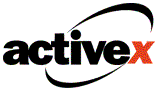

#3일차 과제

##ActiveX가 무엇일까?  

마이크로소프트사에서 만든 COM(Component Object Model)과 OLE(Object Linking and Embedding) 기술 두 개를 합친 소프트웨어 프레임 워크로, 일반 응용 프로그램과 WWW(World Wide Web)을 연결시켜준다. 액티브X를 이용하면 HTML 페이지에 워드나 엑셀과 같은 프로그램에서 만든 데이터를 사용할 수 있으며, 반대로 그 데이터를 가져와서 원하는 형식으로 편집 할 수 있다. 이로 인해 사용자는 인터넷 사용에 보다 높은 유연성을 가질 수 있다. 반면, 사용자의 컴퓨터에 특정 기능을 심기 위해서 컴퓨터의 보안을 일시적으로 해제하는 기능이 있기 때문에 보안에 취약해 분산서비스거부(DDoS) 등 좀비PC 악성코드의 주 감염 경로로 이용되기 쉽다는 평가를 받고 있다. 액티브X는 거대한 소프트웨어 프레임워크지만 대한민국에서는 '인터넷 익스플로러에 붙어서만 실행되는 윈도우 응용프로그램' 정도로 인식되는 것이 일반적이다.

  

##국내 웹에 ActiveX가 정착되게 된 이유 및 배경  

국내 웹에 액티브X가 정착된 이유는 공인인증서와 밀접한 관련이 있다. 1999년 국회에서 전자서명법을 의결한 이후 6개 기관이 공인인증서와 관련한 인증 업무를 담당하게 했는데, 바로 이 공인인증서가 액티브X 기반의 인증 기술이었다. 또한, 액티브X의 개발이 빠르고 쉽다는 것도 계속해서 널리 사용되어 정착되게 된 이유 및 배경 중 하나다.

  

##‘기술적 부채(Technical Debt)’에 대해 알아보기  

기술적 부채(Technical Debt)란 사회와 각 개인들로 이루어진 소프트웨어 등의 결함에 따라서 새로운 기능을 개발하는데 장애가 발생하는 것을 의미한다.

생산성과 마감을 위해 급한 불만 끄듯 코드를 작성하여 코드가 복잡해지고 중복성이 발생된 경우, <꼭 해 두지 않아도 될 것 같아보이는 작업, 프로젝트가 끝나고 나서도 티가 잘 나지 않는 작업들을 제대로 처리하지 않는 경우> 등, 이러한 결함들로 인하여 새로운 기능들을 개발하거나 확장하는데 어려움이 발생하는 데 이것을 기술적 부채라 한다.

  

##위 내용을 조사하며 느낀 점
바른 방향에 대한 고민없이 생산성, 마감만을 위해 급한불만 끄듯 코드를 작성해가며  
중요해보이지 않는 작업, 잘 티가 나지 않는 작업들을 미루고, 넘기고 하다보면  
위 공인인증서 사례처럼 기술적 부채가 눈덩이 처럼 쌓여   
어쩌면 내 손으로 제2의 액티브X 대참사를 만들 수도 있겠단 생각을 하게되었다.
