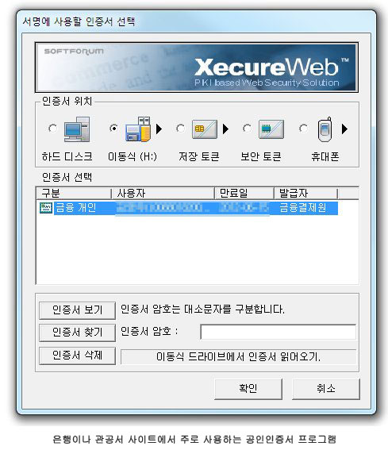

##국내에 공인인증서가 생긴 배경과 그 위험성은?

1999년 전자서명법으로 인해 생겨난 것인데 쉽게 설명하자면 당시 한계가 있는 인터넷 환경에서 인터넷뱅킹과 전자상거래를 할 수 있도록 하기 위해 만들어 진 것이다. 1995년에 SSL 기술이 있었지만 미 정부 정책으로 인해 적용하기 힘들었다. 그 결과 ActiveX를 활용한 공인인증서가 대한민국 인터넷 상 금융거래의 주류가 되었다.
 
 덕분에 전자상거래 업계는 급성장을 이루었지만 이후에 나타날 보안 문제는 예상하지 못했던게 아닐까 싶다. 은행은 위험한 사용자인지 본인인증으로 구분이 가능하지만, 반대로 사용자가 본인 인증을 직접해야 하기에 해당 웹사이트가 진짜 금융 사이트인지 피싱 사이트인지 알 수 없다. 이런 사항을 갖고 있기에 은행은 책임에서 한걸음 물러나 있을 수 있었다.
 
 만약 공인 인증서가 담겨있는 USB가 유출될 경우, 비밀번호를 바꾸는 것만으로는 아무런 소용이 없다. 분실한 기기에 저장된 패스워드는 변경되지 않기 때문이다. 공인인증서는 개인인증을 위해 사용되는 일종의 암호화된 파일이다. 이것만으로는 실제 결제를 발생시킬 수 없다. 이 때문에 보안전문가들은 이미 해커들이 다른 추가적인 은행결제에 필요한 각종 정보를 빼갔을 가능성이 높다고 설명했다.

이에 따라 공인인증서 유출 자체보다도 중요한 것은 PC가 실제로 어떤 악성코드에 감염됐는지를 정확히 판별하는 일이다. 이글루시큐리티 김동우 수석부장은 단순히 공인인증서만 빼가는 것이 아니라 여러가지 복합적인 방식으로 결제에 필요한 모든 정보를 유출시킨다는 점을 주의해야 한다 고 밝혔다.
유출된 공인인증서가 폐기됐다고해서 해킹 위협으로부터 안전한 것은 아닌 셈이다.

##애플리케이션 접근성

### 1. 앱(애플리케이션) 접근성?

모바일 웹 접근성은 장애를 가지고 있는 사람을 포함한 모든 사람이 모바일 기기로 웹을 이용할 수 있는 것을 의미
유선 웹에서 접근성을 보장하는 방법에 모바일 기기의 특수성을 조금만 고려하면 해결 가능
모바일 환경에서의 사용자 경험은 장애를 가진 사람들의 사용자 경험과 유사점을 많이 갖고 있음
장애인, 고령자 등이 비장애인과 동등하게 모바일 기기를 사용하여 애플리케이션을 이용할 수 있도록 

### 2. 앱(애플리케이션) 접근성의 현 상황

모바일 애플리케이션 접근성은 모바일 기기의 접근성을 기반으로 모바일 콘텐츠의 접근성까지도 담보가 되어야 한다. 하지만 모바일 웹 사이트나 앱을 개발할 수 있는 전문가들은 접근성에 대한 이해가 부족한 경우가 많다. 장애인 사용자들 역시 모바일 기기를 포함한 정보통신 기술에 대한 이해가 부족한 경우가 많아 모바일 기기나 앱 사용이 어려움을 겪는것은 물론 개발자들에게 무엇을 개선해 달라고 요구해야 할지도 잘 모르는 경우가 대부분이다. 하물며 우리나라의 경우는 접근성 관련 전문 기술 인력도 부족한 상황이므로 모바일 앱 접근성 향상을 위하여, 접근성에 대한 이해 증진은 물론 기술력 보강, 전문 인력 양성 및 표준화 노력이 절실하게 필요한 상황이다.